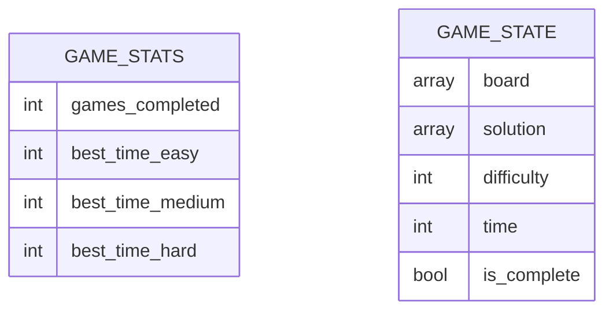

## 1. Architecture Design
```mermaid
graph TD
    subgraph Frontend["前端层"]
        App["App.vue (根组件)"]
        SudokuBoard["SudokuBoard.vue (数独棋盘组件)"]
        GameControls["游戏控制组件"]
        NumberPad["数字键盘组件"]
    end

    subgraph Logic["业务逻辑层"]
        SudokuGenerator["数独生成器"]
        SudokuValidator["数独验证器"]
        GameState["游戏状态管理"]
    end

    subgraph Storage["数据存储层"]
        LocalStorage["LocalStorage"]
    end

    App --&gt; SudokuBoard
    App --&gt; GameControls
    App --&gt; NumberPad
    SudokuBoard --&gt; SudokuGenerator
    SudokuBoard --&gt; SudokuValidator
    SudokuBoard --&gt; GameState
    GameState --&gt; LocalStorage
```

## 2. Technology Description
- **前端框架**：Vue 3 + Vite
- **状态管理**：Vue 3 Composition API (reactive, ref)
- **样式方案**：CSS3 + CSS 变量（支持深色模式）
- **数据存储**：LocalStorage
- **语法规范**：UniApp 组件规范（使用 view、text 等）
- **构建工具**：Vite

## 3. Route Definitions
| Route | Purpose |
|-------|---------|
| / | 游戏主页面 |

## 4. API Definitions (if backend exists)
不适用，纯前端应用

## 5. Server Architecture Diagram (if backend exists)
不适用，纯前端应用

## 6. Data Model (if applicable)

### 6.1 Data Model Definition


### 6.2 Data Definition Language
不适用，使用 LocalStorage 存储数据

### 核心数据结构

```typescript
// 数独单元格
interface Cell {
  value: number | null;
  fixed: boolean;
  error: boolean;
  selected: boolean;
}

// 难度级别
type Difficulty = 'easy' | 'medium' | 'hard';

// 游戏统计
interface GameStats {
  gamesCompleted: number;
  bestTime: {
    easy: number | null;
    medium: number | null;
    hard: number | null;
  };
}

// 游戏状态
interface GameState {
  board: (number | null)[][];
  solution: number[][];
  difficulty: Difficulty;
  time: number;
  selectedCell: { row: number; col: number } | null;
}
```

### 数独生成算法说明

1. **生成完整解**：使用回溯算法填充完整的数独棋盘
2. **移除数字**：根据难度级别随机移除数字：
   - 简单：移除 30 个数字
   - 中等：移除 45 个数字
   - 困难：移除 60 个数字
3. **验证唯一解**：确保移除数字后仍有唯一解

### 数独验证算法

1. 检查每行是否有重复数字
2. 检查每列是否有重复数字
3. 检查每个 3x3 宫格是否有重复数字

