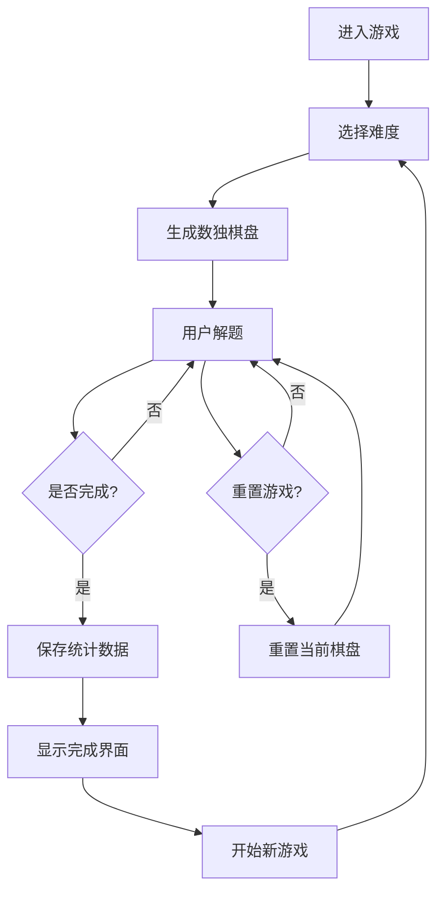

## 1. Product Overview
一个基于 Vue 3 + UniApp 规范开发的数独游戏应用，提供多种难度级别、实时计时器、深色模式和数据持久化等功能。
- 解决用户在休闲时间进行智力游戏的需求，支持离线运行
- 提供简洁美观的界面和流畅的交互体验

## 2. Core Features

### 2.1 User Roles (if applicable)
不适用，只有普通用户角色

### 2.2 Feature Module
1. **游戏页面**：数独棋盘、数字输入、游戏控制
2. **设置页面**：难度选择、主题切换、统计数据

### 2.3 Page Details
| Page Name | Module Name | Feature description |
|-----------|-------------|---------------------|
| 游戏页面 | 数独棋盘 | 9x9 网格，显示数字，支持点击选择单元格 |
| 游戏页面 | 数字输入 | 底部数字键盘，点击输入数字，支持删除功能 |
| 游戏页面 | 游戏控制 | 重置游戏、开始新游戏、检查答案按钮 |
| 游戏页面 | 计时器 | 实时显示游戏时长 |
| 游戏页面 | 错误检查 | 自动检查输入错误，标记重复数字 |
| 游戏页面 | 高亮显示 | 选中单元格时高亮相关行、列和宫格 |
| 设置页面 | 难度选择 | 支持简单、中等、困难三个难度 |
| 设置页面 | 主题切换 | 支持深色/浅色主题切换 |
| 设置页面 | 统计数据 | 显示已完成游戏数、最佳时间等信息 |

## 3. Core Process
用户进入游戏 → 选择难度级别 → 系统生成数独棋盘 → 用户开始解题 → 实时计时和错误检查 → 用户完成游戏或重置 → 统计数据保存

## 4. User Interface Design

### 4.1 Design Style
- **主色调**：蓝色系 (#3b82f6) 作为主色，配合柔和的中性色
- **按钮风格**：圆角矩形，轻微阴影，悬停时放大效果
- **字体**：使用现代无衬线字体，标题加粗，正文清晰易读
- **布局风格**：居中卡片式布局，简洁清爽
- **图标风格**：使用简洁的线性图标

### 4.2 Page Design Overview
| Page Name | Module Name | UI Elements |
|-----------|-------------|-------------|
| 游戏页面 | 数独棋盘 | 9x9 网格，带粗边框的 3x3 宫格，不同状态的单元格颜色 |
| 游戏页面 | 数字键盘 | 底部数字 1-9 按钮，删除按钮，居中布局 |
| 游戏页面 | 控制栏 | 顶部计时器、重置、新游戏、检查按钮 |
| 游戏页面 | 高亮效果 | 选中单元格时高亮相关区域 |
| 设置页面 | 难度选择 | 三个难度选项卡 |
| 设置页面 | 主题切换 | 开关控件 |
| 设置页面 | 统计卡片 | 带图标的数据展示 |

### 4.3 Responsiveness
- 移动端优先，适配不同屏幕尺寸
- 触摸优化，按钮和单元格大小适合手指点击
- 响应式布局，在平板和桌面端也能良好显示

### 4.4 3D Scene Guidance (if applicable)
不适用

